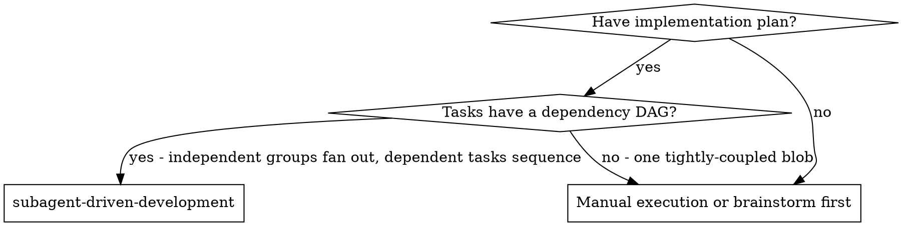
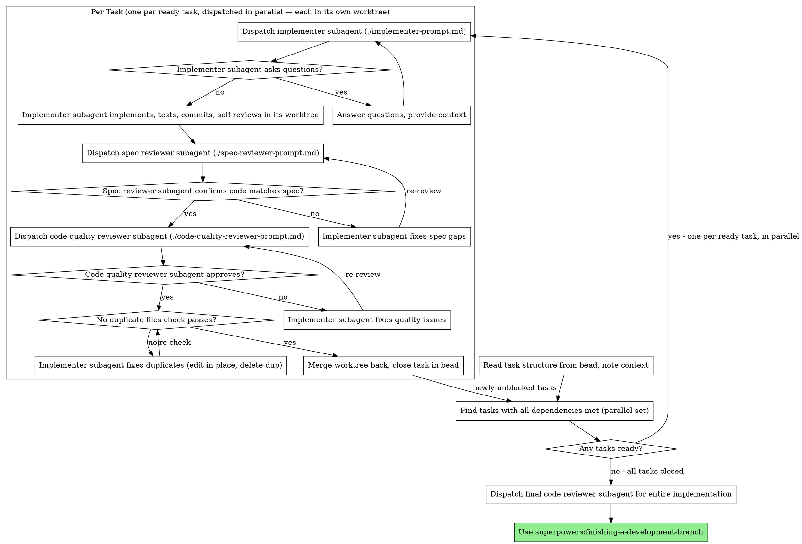

# Subagent-Driven Development

Execute plan by dispatching fresh subagent per task, with two-stage review after each: spec compliance review first, then code quality review.

**Why subagents:** You delegate tasks to specialized agents with isolated context. By precisely crafting their instructions and context, you ensure they stay focused and succeed at their task. They should never inherit your session's context or history — you construct exactly what they need. This also preserves your own context for coordination work.

**Core principle:** Fresh subagent per task + two-stage review (spec then quality) = high quality, fast iteration

**Parallel by default:** The plan carries a dependency DAG (see superpowers:writing-plans). Independent task-groups — those sharing no dependency — are dispatched **in parallel**, each implementer subagent working in **its own git worktree** and merging back on completion. Sequential execution applies only where a real dependency exists between tasks. Fan out wherever the DAG allows it; don't serialize work that has no reason to be serial.

**Continuous execution:** Do not pause to check in with your human partner between tasks. Execute all tasks from the plan without stopping. The only reasons to stop are: BLOCKED status you cannot resolve, ambiguity that genuinely prevents progress, or all tasks complete. "Should I continue?" prompts and progress summaries waste their time — they asked you to execute the plan, so execute it.

## When to Use



**What this skill gives you:**
- Same session (no context switch)
- Fresh subagent per task (no context pollution)
- Two-stage review after each task: spec compliance first, then code quality
- Parallel fan-out of independent task-groups; sequencing only where the DAG demands it
- Faster iteration (no human-in-loop between tasks)

## The Process

The controller reads the task structure from the **bead** (its task list, or sub-beads for large work — see "Reading the Plan" below), then drives the loop: find every task whose dependencies are met, dispatch those in parallel, review each, mark done, repeat.



Each task in the parallel set runs the full per-task loop independently. The controller waits for every dispatched task to close, then recomputes the ready set — closing a task may unblock dependents. When the ready set is empty and all tasks are closed, proceed to final review.

## Reading the Plan

The task structure comes from the **bead**, not a plan file the subagent reads.

**Small/medium work:** the plan's task list lives in the parent bead. The controller works through that list and marks each task done in the bead as it closes.

**Large work:** each task is its own **sub-bead**, with `bd dep add` edges encoding the dependency DAG. `bd ready` surfaces exactly which sub-beads have no unmet dependency — that is the parallel set the controller dispatches now. As tasks close, `bd ready` surfaces the newly-unblocked ones. For large work there may also be a separate plan file (per the superpowers:writing-plans hybrid model); use it as the source of heavy per-task code detail to hand the implementer, but the task structure and dependency edges come from beads.

## Model Selection

Use the least powerful model that can handle each role to conserve cost and increase speed.

**Mechanical implementation tasks** (isolated functions, clear specs, 1-2 files): use a fast, cheap model. Most implementation tasks are mechanical when the plan is well-specified.

**Integration and judgment tasks** (multi-file coordination, pattern matching, debugging): use a standard model.

**Architecture, design, and review tasks**: use the most capable available model.

**Task complexity signals:**
- Touches 1-2 files with a complete spec → cheap model
- Touches multiple files with integration concerns → standard model
- Requires design judgment or broad codebase understanding → most capable model

## Handling Implementer Status

Implementer subagents report one of four statuses. Handle each appropriately:

**DONE:** Proceed to spec compliance review.

**DONE_WITH_CONCERNS:** The implementer completed the work but flagged doubts. Read the concerns before proceeding. If the concerns are about correctness or scope, address them before review. If they're observations (e.g., "this file is getting large"), note them and proceed to review.

**NEEDS_CONTEXT:** The implementer needs information that wasn't provided. Provide the missing context and re-dispatch.

**BLOCKED:** The implementer cannot complete the task. Assess the blocker:
1. If it's a context problem, provide more context and re-dispatch with the same model
2. If the task requires more reasoning, re-dispatch with a more capable model
3. If the task is too large, break it into smaller pieces
4. If the plan itself is wrong, escalate to the human

**Never** ignore an escalation or force the same model to retry without changes. If the implementer said it's stuck, something needs to change.

## External-Resource Tasks

When a task's test would require an external resource — GPU hardware, a paid or rate-limited API, real credentials with a cost, human visual/subjective confirmation, or any un-fakeable infrastructure — the implementer FLAGS it to the controller rather than building blind. The controller brings it to the human partner to decide before the task is built. On decline, a mocked test is substituted: **mock the boundary, not the logic under test.**

## No-Duplicate-Files Check

After code quality review passes and before closing the task in the bead, the controller runs a deterministic post-write check over the task's diff. For each **new** file the implementer created, look in the same directory for an existing file whose basename matches the new file's basename minus one of these suffix patterns:

- `_v[0-9]+` — e.g. `foo_v2.py` next to `foo.py`
- `_new` — e.g. `foo_new.ts` next to `foo.ts`
- `_modified` — e.g. `foo_modified.go` next to `foo.go`
- `_copy` — e.g. `foo_copy.js` next to `foo.js`
- `_old` — e.g. `foo_old.py` next to `foo.py`
- ` 2` (trailing space-2) — e.g. `foo 2.tsx` next to `foo.tsx`

If any pair exists, the task is **not** complete: re-dispatch the implementer to either (a) edit the existing file in place and delete the duplicate, or (b) justify why both files must coexist (rare — requires a real reason). The `foo_v2.py` pattern is one of the clearest signals the implementer never actually read and edited the existing file; a 5-second deterministic check catches it before merge, no LLM judgment required.

## Prompt Templates

- `./implementer-prompt.md` - Dispatch implementer subagent
- `./spec-reviewer-prompt.md` - Dispatch spec compliance reviewer subagent
- `./code-quality-reviewer-prompt.md` - Dispatch code quality reviewer subagent

## Example Workflow

```
You: I'm using Subagent-Driven Development to execute this plan.

[Large work: task structure is sub-beads under parent bead bd-42]
[bd ready → bd-43 (Hook installation script), bd-44 (Config schema) have no unmet deps]
[bd-45 (Recovery modes) depends on bd-43; not ready yet]

[Dispatch bd-43 and bd-44 in parallel — each implementer in its own worktree]
[Per-task loop runs independently for each]

bd-43 Implementer: "Before I begin - should the hook be installed at user or system level?"
You: "User level (~/.config/superpowers/hooks/)"
bd-43 Implementer: "Got it. Implementing now..."
[Later] bd-43 Implementer:
  - Implemented install-hook command
  - Added tests, 5/5 passing
  - Self-review: Found I missed --force flag, added it
  - Committed in worktree

[Dispatch spec compliance reviewer for bd-43]
Spec reviewer: ✅ Spec compliant - all requirements met, nothing extra
[Get git SHAs, dispatch code quality reviewer]
Code reviewer: Strengths: Good test coverage, clean. Issues: None. Approved.
[Merge bd-43 worktree back, bd close bd-43]

[bd-44 finishes its loop similarly, merge back, bd close bd-44]

[bd ready → bd-45 (Recovery modes) now unblocked]
[Dispatch bd-45 implementer in its own worktree]

bd-45 Implementer: [No questions, proceeds]
bd-45 Implementer:
  - Added verify/repair modes
  - 8/8 tests passing
  - Self-review: All good
  - Committed in worktree

[Dispatch spec compliance reviewer]
Spec reviewer: ❌ Issues:
  - Missing: Progress reporting (spec says "report every 100 items")
  - Extra: Added --json flag (not requested)

[Implementer fixes issues]
Implementer: Removed --json flag, added progress reporting

[Spec reviewer reviews again]
Spec reviewer: ✅ Spec compliant now

[Dispatch code quality reviewer]
Code reviewer: Strengths: Solid. Issues (Important): Magic number (100)

[Implementer fixes]
Implementer: Extracted PROGRESS_INTERVAL constant

[Code reviewer reviews again]
Code reviewer: ✅ Approved

[Merge bd-45 worktree back, bd close bd-45]

...

[After all sub-beads closed]
[Dispatch final code-reviewer]
Final reviewer: All requirements met, ready to merge

Done!
```

## Advantages

**vs. Manual execution:**
- Subagents follow TDD naturally
- Fresh context per task (no confusion)
- Independent tasks run in parallel, each in its own worktree (no interference)
- Subagent can ask questions (before AND during work)

**Efficiency gains:**
- No file reading overhead (controller provides full text)
- Controller curates exactly what context is needed
- Subagent gets complete information upfront
- Questions surfaced before work begins (not after)
- `bd ready` drives the parallel fan-out — no manual dependency bookkeeping

**Quality gates:**
- Self-review catches issues before handoff
- Two-stage review: spec compliance, then code quality
- Review loops ensure fixes actually work
- Spec compliance prevents over/under-building
- Code quality ensures implementation is well-built

**Cost:**
- More subagent invocations (implementer + 2 reviewers per task)
- Controller does more prep work (extracting all tasks upfront)
- Review loops add iterations
- But catches issues early (cheaper than debugging later)

## Red Flags

**Never:**
- Start implementation on main/master branch without explicit user consent
- Skip reviews (spec compliance OR code quality)
- Proceed with unfixed issues
- Serialize tasks that have no dependency between them (fan out the DAG's independent groups)
- Dispatch parallel implementers into a shared workspace — each parallel implementer gets its own git worktree, merges back on completion
- Make subagent read the plan/bead (provide full task text instead)
- Skip scene-setting context (subagent needs to understand where task fits)
- Ignore subagent questions (answer before letting them proceed)
- Build an external-resource task without flagging it (implementer flags, controller asks the human, mock the boundary on decline)
- Accept "close enough" on spec compliance (spec reviewer found issues = not done)
- Skip review loops (reviewer found issues = implementer fixes = review again)
- Let implementer self-review replace actual review (both are needed)
- **Start code quality review before spec compliance is ✅** (wrong order)
- Close a task in the bead while either review has open issues
- **Implementer created `<basename>_v2` / `_new` / `_modified` / `_copy` / `_old` / `<basename> 2` alongside the original** — re-dispatch to edit the existing file in place and delete the duplicate (or justify why both must coexist)

**If subagent asks questions:**
- Answer clearly and completely
- Provide additional context if needed
- Don't rush them into implementation

**If reviewer finds issues:**
- Implementer (same subagent) fixes them
- Reviewer reviews again
- Repeat until approved
- Don't skip the re-review

**If subagent fails task:**
- Dispatch fix subagent with specific instructions
- Don't try to fix manually (context pollution)

## Integration

**Required workflow skills:**
- **superpowers:using-git-worktrees** - Each parallel implementer works in its own worktree
- **superpowers:writing-plans** - Creates the plan (and dependency DAG) this skill executes
- **superpowers:requesting-code-review** - Code review template for reviewer subagents
- **superpowers:finishing-a-development-branch** - Complete development after all tasks

**Subagents should use:**
- **superpowers:test-driven-development** - Subagents follow TDD for each task
